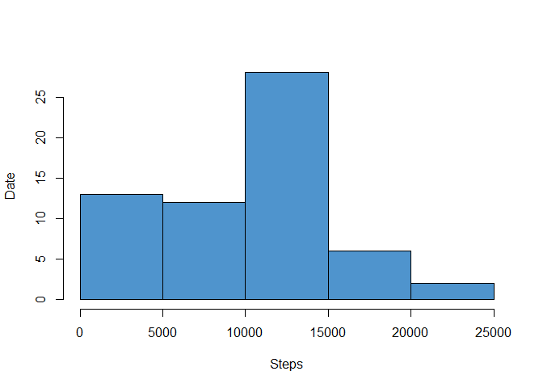
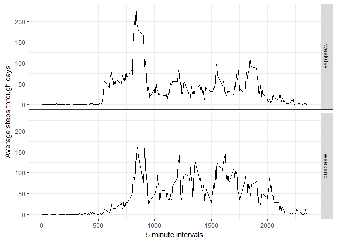

## Loading and preprocessing the data

```r
if (!file.exists('activity.zip')) {
  download.file("https://d396qusza40orc.cloudfront.net/repdata%2Fdata%2Factivity.zip", 'activity.zip')
}
if (!file.exists('activity.csv')) {
  unzip('activity.zip')  
}
dataset <- read.csv('activity.csv')
```
 
 
## What is mean total number of steps taken per day?
Lets aggregate step data by days and look at our anonynus user steps distribution

```r
totalStepsByDay <- aggregate(dataset$steps, by=list(dataset$date), FUN=sum, na.rm=TRUE)
hist(totalStepsByDay$x, 
     xlab = 'Steps',
     ylab = 'Date',
     main = '',
     col = 'steelblue3'
)
```

<!-- -->
 
 
### The mean steps count for two months is 9354 and median is 10395.
 
 
## What is the average daily activity pattern?

```r
meanStepsByInterval <- aggregate(dataset$steps, by=list(interval = dataset$interval), FUN=mean, na.rm=TRUE)
plot(meanStepsByInterval,
    xlab = '5 minute intervals',
    ylab = 'Average steps through days',
    col = 'steelblue3',
    type = "l"
)
```

<!-- -->
 
### The most active interval is 835.


## Imputing missing values
There were total 2304 observations with missing values in this data set.
Let's fill the NA data with the 5 mintue intervals mean to make our calculations more accurate.

```r
for(i in 1:nrow(dataset)) {
  if (is.na(dataset[i, ]$steps)) {
    meanStepsIndex <- which(meanStepsByInterval$interval == dataset[i, ]$interval);
    dataset[i, ]$steps <- round(meanStepsByInterval[meanStepsIndex, ]$x)
  }
}
summary(dataset)
```

```
##      steps                date          interval     
##  Min.   :  0.00   2012-10-01:  288   Min.   :   0.0  
##  1st Qu.:  0.00   2012-10-02:  288   1st Qu.: 588.8  
##  Median :  0.00   2012-10-03:  288   Median :1177.5  
##  Mean   : 37.38   2012-10-04:  288   Mean   :1177.5  
##  3rd Qu.: 27.00   2012-10-05:  288   3rd Qu.:1766.2  
##  Max.   :806.00   2012-10-06:  288   Max.   :2355.0  
##                   (Other)   :15840
```

Now we will check our totals on the new data set:

```r
totalStepsByDay <- aggregate(dataset$steps, by=list(dataset$date), FUN=sum, na.rm=TRUE)
hist(totalStepsByDay$x, 
     xlab = 'Steps',
     ylab = 'Date',
     main = '',
     col = 'steelblue3'
)
```

<!-- -->
 
### In the new data set mean steps is 10766 and median is 10762. 
### We see, that our new results look more accurate
  
## Are there differences in activity patterns between weekdays and weekends?
Lets mark when our observations was done on weekends or weekdays

```r
dataset$dayType <- ifelse(as.POSIXlt(dataset$date)$wday %in% c(0,6), 'weekend', 'weekday')
```

Lets compare weekends to weekdays activity:

```r
meanStepsByIntervalAndDayType <- aggregate(steps ~ interval + dayType, data=dataset, mean)
library(ggplot2)
ggplot(meanStepsByIntervalAndDayType, aes(interval, steps)) + 
    geom_line() + 
    theme_bw() +
    facet_grid(dayType ~ .) +
    xlab('5 minute intervals') + 
    ylab('Average steps through days')
```

<!-- -->

### As we weekends patters does not differ very much. I can assume, that this person has more lazy mornings and a little more active daytime in the weekends.
